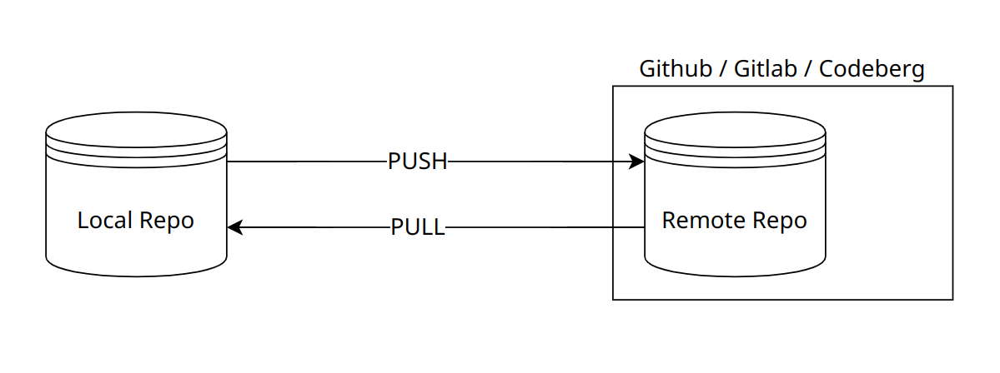
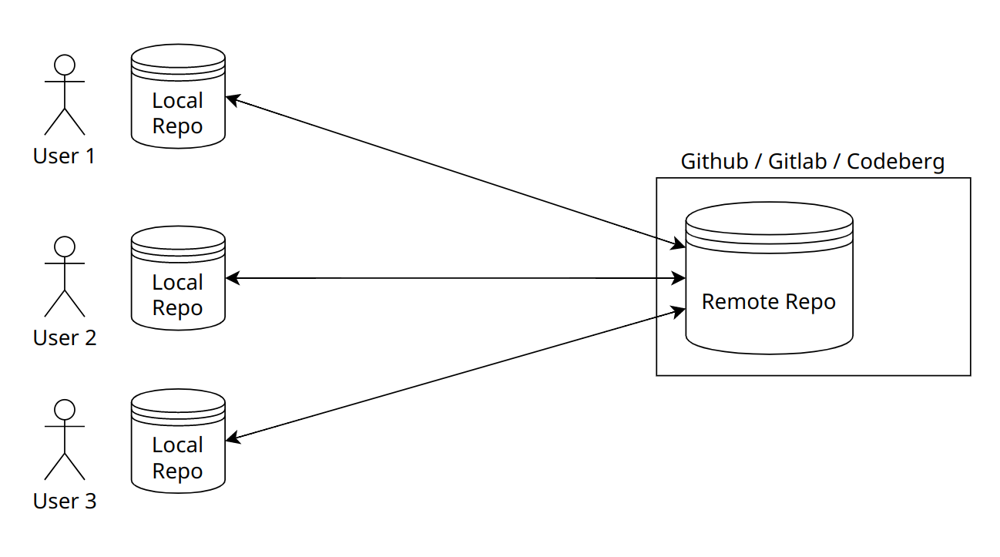
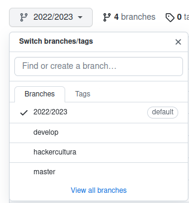
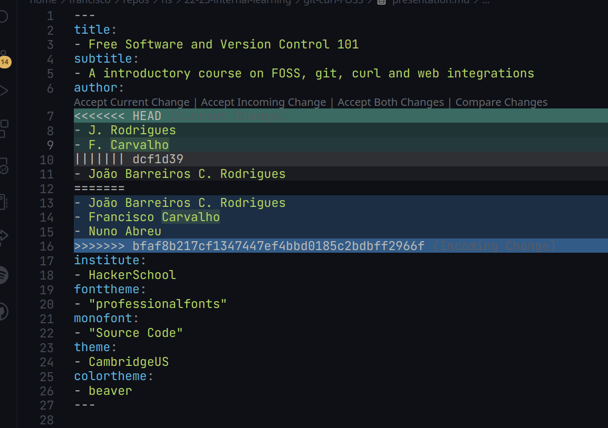

---
title:
- Free Software and Version Control 101
subtitle:
- A introductory course on FOSS, git, curl and web integrations
author:
- J. Rodrigues
- F. Carvalho
institute:
- HackerSchool
fonttheme:
- "professionalfonts"
monofont:
- "Source Code"
theme:
- CambridgeUS
colortheme:
- beaver
---

# Version control?

## What is version control?

Version control is the practice of managing and documenting _data_ (code, schematics, etc.)
iterations.

It is particularly important in our context of Free and Open Source software,
as a careful documentation of alterations between versions and the ability to inspect
older or deprecated sources can make issue resolution and feature integration much more agile.

### git?

Git is a version control software created by Linus Torvalds (which also created the Linux Kernel).
Its free software under the GPL v2.0.

Git allows cloning, pulling, pushing, etc. of data stored in git instances.

##  
It has happened to all of us!

Time to ditch this...

## For something waaaay better


##


## Remotes

{width=280}
{width=350}

# Let's Start!

##

> We will teach you how to work with it via the command line, but there are tools, like VS Code that provide the same functionality via a graphical interface

## Setting up your git/GitHub environment
1. Create a GitHub account (using your institutional e-mail is often valuable).
2. Get the `git` and `github-cli` packages (this last one is optional).
3. Log in in github-cli (or if you prefer not to use it setup an SSH Key/ Personal Access Token)
4. Configure user in git with

	```bash
	git config --global user.name "@user.name" 

	git config --global user.email @user.email
	```

## Setting up a GitHub repository
1. Go to [https://github.com/new](https://github.com/new) 

   (it's easier if you check "Add a README file")

After you've created your repo you need to download a local copy to do your work

2. Use the command `git clone` to do that:

	```bash
	git clone <url_of_your_repo>
	```

You should now have a new folder with a copy of the repository you've just created

# Your first commit!

## Git Status
This command alows you to view the state of your project (repo)


## Add
- When we want the git log changes made to a file `git add <file_path>` 
- When the file hasn't ever been tracked `add` tells git to start to
- This command only selects the files/modifications, it **does not** commit 


## Commit
- To commit (record the selected changes to the history) we use the command `git commit -m "commit message"`


## Push
- You can push your history to a remote repo using the command `git push <name_of_remote_repo>`
    - Usually when using Github this remote is called **origin**
- You can even have multiple remotes!
    - to add one use `git remote add <name> <url>`, as seen in the curl part of this presentation


## Frontends (Vscode)


## Repositories and actions (*)
{height=260px}

## Branching
+ Branching is a elementary tool that is part of git
+ A branch is an alternative streamline from main
	+ It is used by collaborators that normally want to push some code that can break the master's features or that has yet to be fully tested
{height=150px}
	+ A branch can be switched into using ``` git checkout @branch``` or can be created and switched into by adding the ``` -b ``` flag to the previous command
+ In medium-small projects, branching may be enough

## Forking (*)
- !!! Note: This is a feature of some git instances (GitHub, GitLab, etc.), but not git itself, therefore we will not use the ```git```
terminal package in this section
- Nonetheless forking is an important collaboration tool, as it allows you to make your own private copy of an exciting repository
- This means you can work freely, without pushing "trash" to the main repo
    - You can even start your own version of the project!
- Once you're ready to merge your changes into the main repo you can open a **pull request**
    - This is one way of contributing code to a public repo if you aren't a contributor (=have write access) 


## Pull Requests


When we want to merge with the original repo we open a pull request


## Conflicts (*)
Sometimes, when you and another collaborators make a change to the same line, GitHub's auto-merge feature cannot fix it.

{height=160px}

You will have to manually fix it by choosing which lines to keep from each branch! Trivial!

# Tying our work with freedom

## On FOSS and CC

The first written document that described FOSS as a trend among hackers, programmers, engineers, etc. was the GNU Manifesto. This file also gave the philosophical foundations for the Free Software Foundation Network, and FOSS worldwide.

In the context of HackerSchool FOSS is a core principle. Initiated in the administration of 22-23, HackerSchool has embraced free alternatives such as _GNU/Linux distros, FreeCAD, Jitsi, Signal_, allowing hackers to walk a path that is flexible, secure, and overall hacker-y.

Since we benefit from this communal effort it is only fair that we also contribute to the greater good, therefore all HackerSchool code and documents are non-proprietary.

## The two software architectures

+ **The Cathedral**

	We can apply this architectural decision to both:

	+ **Free Software**

		The source code is centralized in an organizational environment, however it is released with any main binary. You will rarely look to the code in development.

	+ **Proprietary Software**

		The source code is never released, it is kept confined within the Corporations walls. The binary is spewed out of it, but you will have to reverse it to understand what it does! 

## The two software architectures
+ **The Bazaar**

	The Bazaar is characteristic of free software.

	In a Bazaar architecture the source code is visible at all times, being normally communal projects, made of differently written modules. Everything is a node on a de-centralized tree! 

	This architecture as the advantage of going according to Linus's Law:


	_"given enough eyeballs, all bugs are shallow"_

## Licenses

{height=260px}
